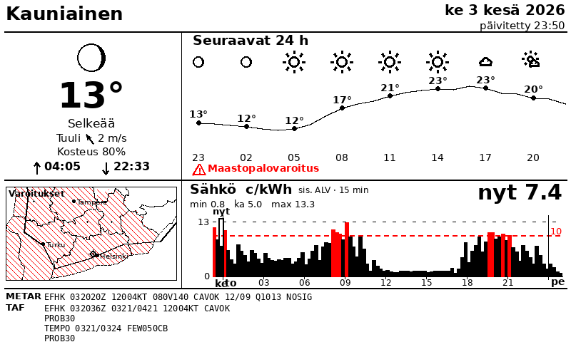
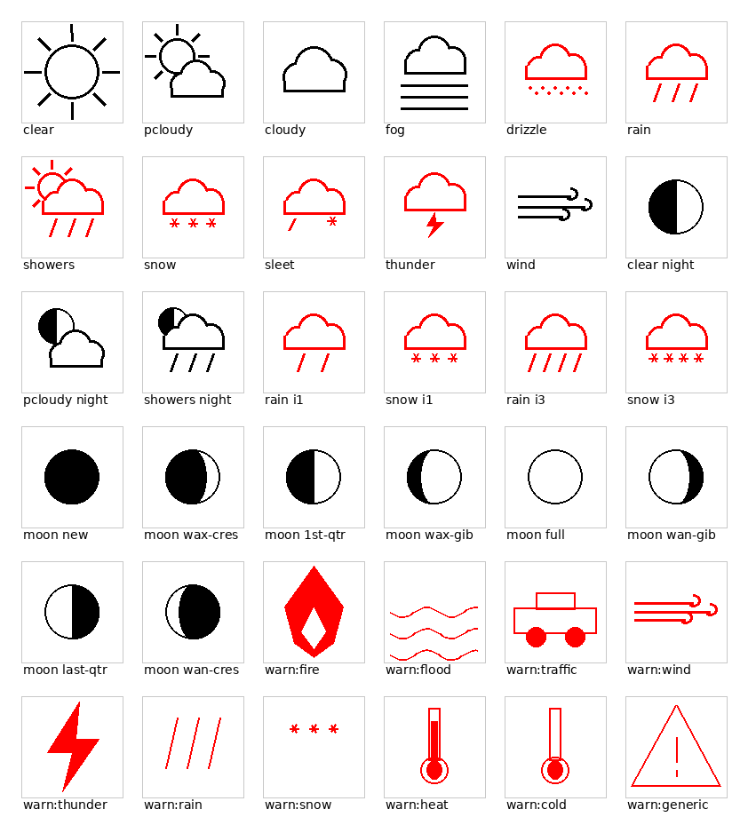

# E-paper weather + electricity display

A Python app that drives a **Waveshare 7.5" black/white/red e-paper panel**
(`epd7in5b` V2, 800×480) from an **Odroid C2** (Ubuntu 20.04). It shows:

- **Current conditions** for Kauniainen — big temperature, sky symbol, wind
  (direction + speed), humidity, and today's **sunrise / sunset** times. The icon
  is **night-aware**: a **moon drawn at its real phase** replaces the sun after
  sunset.
- **Next 24 hours** — official FMI forecast as a temperature curve with hourly
  weather symbols (night-aware) and precipitation bars. **Bad weather (rain,
  drizzle, snow, sleet, thunder) is drawn in red**, as are sub-zero temperatures.
- **Weather warnings** — official **FMI CAP warnings** (`alerts.fmi.fi`) filtered
  to the location by point-in-polygon, shown as a red **icon + label** banner
  (fire, flood, traffic, wind, thunder, rain, snow, heat, cold, …). Falls back to
  forecast-derived warnings (strong gusts, heavy precip, …) for any category the
  CAP feed doesn't cover or if it's unavailable.
- **Electricity prices** (Nord Pool FI spot from [sahkotin.fi](https://sahkotin.fi))
  as a **15-minute** bar chart from the previous half hour through whatever is
  published ahead. Slots **at or above the threshold (10 c/kWh incl. VAT) are
  drawn in red**, with a red threshold line and a "now" marker.
- **METAR / TAF** for EFHK (Helsinki-Vantaa) as raw aviation text along the
  bottom, in a monospaced font.

Data sources:

- **Weather:** FMI open data WFS — the official human-edited Scandinavian
  forecast (`fmi::forecast::edited::weather::scandinavia::point::simple`). No key.
- **Electricity:** `https://sahkotin.fi/prices.csv` (EUR/MWh → c/kWh, `?vat`,
  `?quarter` for 15-minute resolution). Its certificate fails default
  verification, so that one request is made with **TLS verification disabled**
  (see `config.SAHKOTIN_INSECURE_TLS`).
- **Sun & moon:** computed locally in `epaper/astro.py` (no network) — solar
  altitude for day/night, the sunrise equation for rise/set, and the synodic
  cycle for moon phase.
- **METAR/TAF:** NOAA Aviation Weather Center
  (`aviationweather.gov/api/data/{metar,taf}?ids=EFHK&format=raw`, free, no key).



Weather icons (day/night, intensities, moon phases):



## Why bit-banged SPI?

The Odroid C2's Amlogic kernel here (3.16) ships **no hardware SPI controller
driver** — only software-SPI modules. The panel is write-only over SPI, so the
driver in `epaper/display/epd7in5b.py` **bit-bangs SPI over GPIO**. GPIO goes
through `odroid-wiringpi` (memory-mapped via `/dev/gpiomem`, fast); a pure-stdlib
`/sys/class/gpio` fallback is included for any board.

## Wiring (Waveshare panel → Odroid C2 40-pin header)

These are **physical header pin numbers** and reproduce Waveshare's official
*E-Paper Driver HAT → Raspberry Pi* table exactly (verified against the
[Waveshare wiki](https://www.waveshare.com/wiki/E-Paper_Driver_HAT)). The Odroid
C2's 40-pin header carries power/GND/GPIO at the same physical positions, so the
HAT seats directly on it and the supplied ribbon maps 1:1.

| EPD pin   | RPi BCM | Physical pin | Role                         |
|-----------|---------|--------------|------------------------------|
| VCC       | 3.3 V   | 1            | power                        |
| GND       | GND     | 6            | ground                       |
| DIN / MOSI| BCM10   | 19           | SPI data                     |
| CLK / SCLK| BCM11   | 23           | SPI clock                    |
| CS        | BCM8    | 24           | chip select                  |
| DC        | BCM25   | 22           | data/command                 |
| RST       | BCM17   | 11           | reset                        |
| BUSY      | BCM24   | 18           | busy (input)                 |
| PWR       | BCM18   | 12           | panel power gate (held HIGH) |

**PWR** exists on the newer Driver HAT revision (it switches panel power through a
MOSFET); the driver holds it HIGH while running and LOW on exit. Bare 8-wire
panels have no PWR line — set `PIN_PWR = 0` (or `EPD_PIN_PWR=0`) to disable it.

### Driver HAT config switches

The Driver HAT has two on-board switches that **must** be set correctly:

| Switch | Set to | Why |
|--------|--------|-----|
| **Interface Config** | **0** (4-line SPI) | This driver uses a dedicated DC line (4-wire SPI). On `1` (3-line SPI) the DC pin is ignored and the panel stays blank. |
| **Display Config**   | **A** | Correct for the 7.5" panel. If the image is garbled/abnormal, flip to **B**. |

Why the C2 needs no hardware SPI: on the Pi, DIN/CLK/CS land on the SPI0 pins,
but the C2 has no SPI controller on this kernel. The HAT is just passive routing
(plus the PWR MOSFET), so we drive those same physical pins as plain GPIO and
**bit-bang** the SPI. Change pins in `config.py` / `EPD_PIN_*` if you wire
differently.

## Quick start

### On your workstation (preview without hardware)

```bash
pip install -r requirements.txt
EPD_BACKEND=mock python3 main.py      # writes out/display.png + 1-bit planes
python3 scripts/icon_sheet.py         # review all weather icons + moon phases
```

If your machine lacks a Python CA bundle and FMI fails TLS verification, add
`EPD_HTTP_INSECURE=1` for the preview only.

### On the Odroid C2

```bash
# from the workstation: copy code + install deps + set timezone
SETUP=1 ./deploy.sh

# verify wiring first (blink a pin, then a full panel test pattern)
ssh root@10.1.1.58 'cd /opt/epaper-display && sudo python3 scripts/gpio_probe.py 11'
ssh root@10.1.1.58 'cd /opt/epaper-display && sudo python3 scripts/epdtest.py'

# one real refresh
ssh root@10.1.1.58 'cd /opt/epaper-display && python3 main.py'
```

Then enable the 15-minute auto-refresh timer:

```bash
SETUP=1 SERVICE=1 ./deploy.sh
# or on the device: sudo INSTALL_SERVICE=1 bash scripts/setup_target.sh
systemctl status epaper.timer
```

## Configuration

All knobs live in [`config.py`](config.py):

| Setting | Meaning |
|---|---|
| `LATITUDE` / `LONGITUDE` / `LOCATION_NAME` | forecast point (default Kauniainen) |
| `LANGUAGE` | UI language: `en` / `fi` / `sv` (METAR/TAF stays raw) |
| `PRICE_RED_THRESHOLD_C_KWH` | red threshold, default `10.0` c/kWh |
| `SAHKOTIN_INCLUDE_VAT` | request VAT-included prices (default true) |
| `PRICE_QUARTERS` | 15-minute resolution (default true; false = hourly) |
| `PRICE_PAST_MINUTES` | history shown left of "now" (default 30) |
| `PRICE_FUTURE_HOURS` | request upper bound; chart ends where data does (default 48) |
| `DISPLAY_BACKEND` | `auto` / `epd` / `mock` (env `EPD_BACKEND`) |
| `GPIO_BACKEND` | `wiringpi` / `sysfs` (env `EPD_GPIO`) |
| `PIN_*` | pin assignment (env `EPD_PIN_*`) |

## How it works

```
main.py
 ├─ epaper/weather.py      FMI WFS  → current / hourly / daily + warnings
 ├─ epaper/astro.py        sun day/night, sunrise/sunset, moon phase (no network)
 ├─ epaper/electricity.py  sahkotin → 15-min prices (insecure TLS)
 ├─ epaper/aviation.py     METAR/TAF for EFHK (aviationweather.gov)
 ├─ epaper/alerts.py       FMI CAP warnings (alerts.fmi.fi), polygon-filtered
 ├─ epaper/finmap.py       compact S-Finland warnings map (hatched warned areas)
 ├─ epaper/icons.py        vector weather icons + phased moon
 ├─ epaper/render.py       PIL → 800×480 black/red/white image
 │   └─ split_planes()     → two 1-bit planes (black, red)
 └─ epaper/display/
     ├─ base.py            backend factory (auto/epd/mock)
     ├─ epd7in5b.py        bit-bang SPI panel driver
     ├─ gpio.py            wiringpi + sysfs GPIO backends
     └─ mock writes PNGs to out/
```

Resilience: each refresh caches the last good data to `out/last_good.pkl`. If a
source fails, the screen still renders from cache and shows a red **STALE** flag,
so a flaky network never blanks the panel.

## Troubleshooting

- **`BUSY timeout`** — check VCC/GND and the BUSY pin; confirm pins with
  `scripts/gpio_probe.py`. BUSY is active-low.
- **Nothing on screen but no error** — wrong DIN/CLK/CS/DC pins. Re-check the
  wiring table; run `scripts/epdtest.py`.
- **`wiringpi not installed`** — re-run `setup_target.sh`, or fall back with
  `EPD_GPIO=sysfs` (set numeric kernel GPIO numbers in `config.py`).
- **Refresh is slow** — a full B/W/R refresh on this panel takes ~20–26 s; the
  bit-bang data clock-out adds a few seconds. That's expected.
- **Tomorrow's prices missing** — Nord Pool publishes them ~14:15 local; before
  that the chart only shows through end of today.
- **Wrong times** — set the device timezone: `timedatectl set-timezone Europe/Helsinki`.

## License

MIT — see [LICENSE](LICENSE). The bundled DejaVu fonts in `fonts/` are
distributed under their own permissive (Bitstream Vera / public-domain) license.
